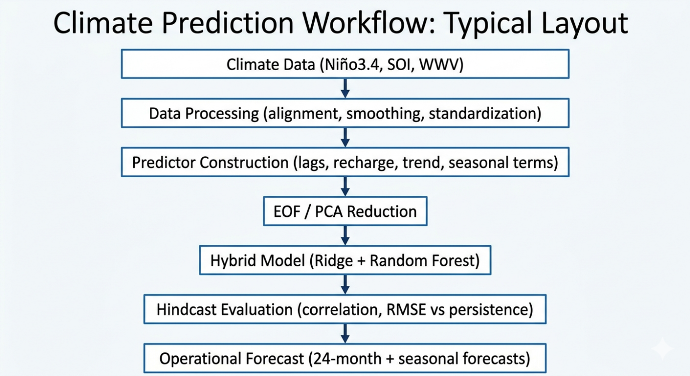
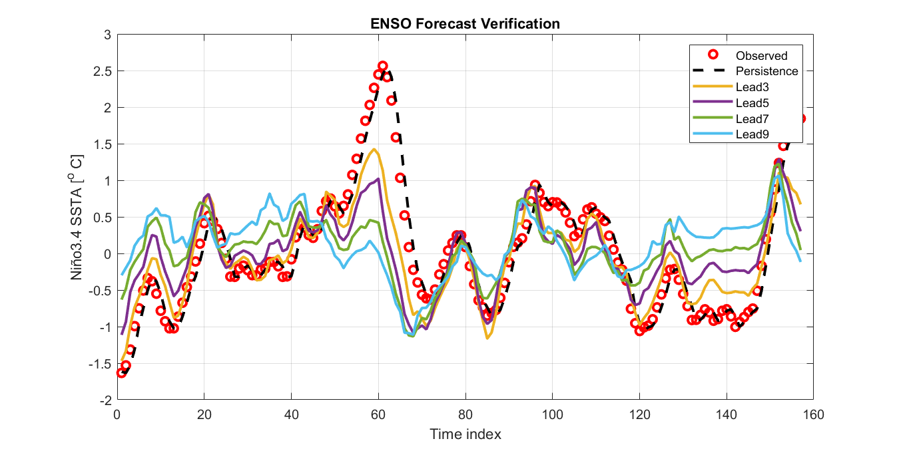
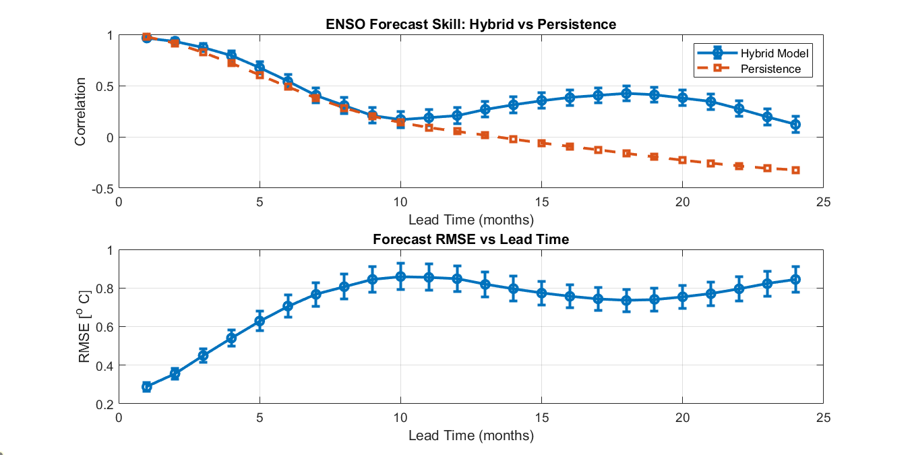
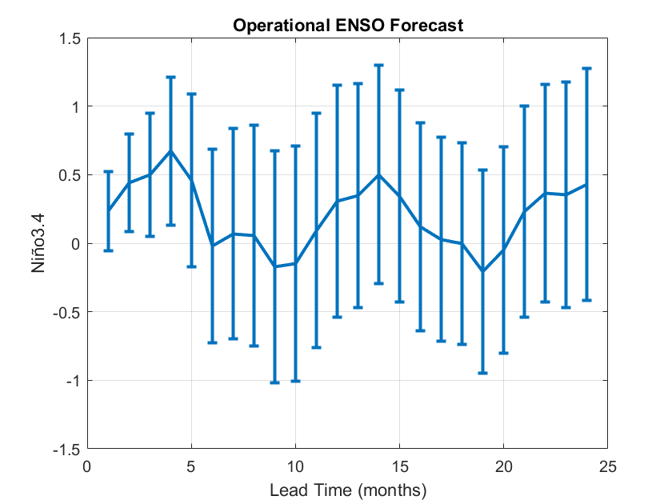
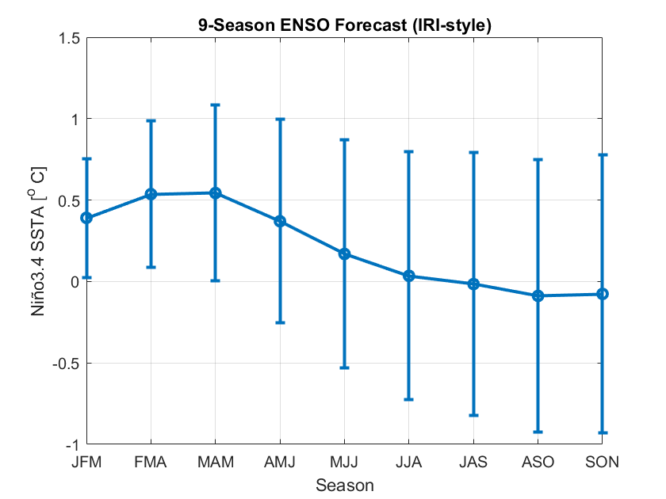
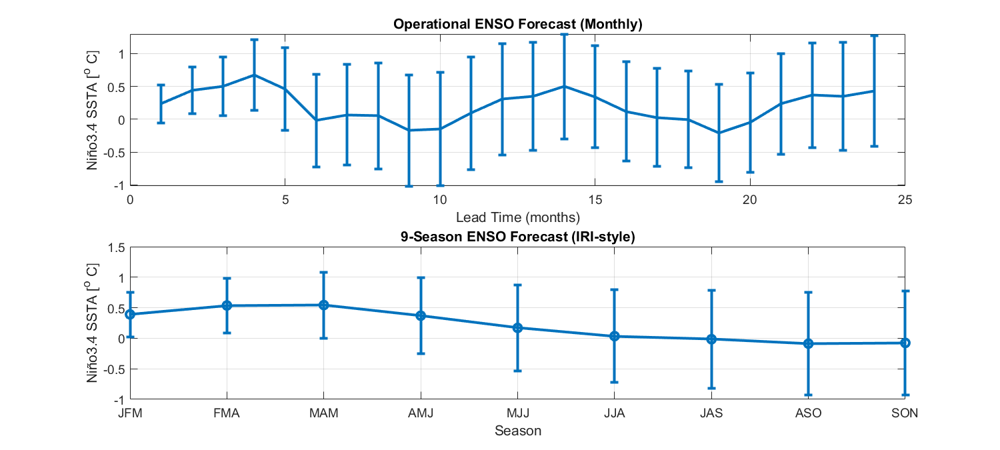

# Outputs

This folder contains generated figures and model outputs from the ENSO prediction framework.

## Results

### Figure 1

Conceptual workflow of the hybrid ENSO forecasting system. Monthly climate indices (Niño-3.4 SST anomalies, Southern Oscillation Index, and equatorial Pacific warm water volume) are aligned, smoothed, and standardized. Lagged predictors and physically motivated variables (recharge, trend, and seasonal harmonics) are constructed and reduced using empirical orthogonal function (EOF) analysis. The resulting predictors are used to train ridge regression and random forest models whose predictions are combined into a hybrid forecast. Hindcast skill is evaluated using correlation and RMSE relative to persistence, and the trained system generates operational monthly forecasts up to 24 months ahead and derived seasonal outlooks

---

### Figure 2

Comparison between observed Niño-3.4 SST anomalies and hybrid model forecasts for selected lead times (3, 5, 7, and 9 months). The hybrid model reproduces the major ENSO fluctuations during the testing period and generally follows the observed evolution more closely than persistence forecasts. Forecast skill is strongest at shorter lead times, while amplitude damping and phase shifts become more evident at longer lead times.

---

### Figure 3

Forecast skill of Niño-3.4 SST anomaly predictions as a function of lead time. Correlation with observations and root-mean-square error (RMSE) are shown for both the hybrid model and a persistence forecast. Correlation measures the ability of the forecast to reproduce the temporal evolution of ENSO variability, while RMSE quantifies the magnitude of forecast errors.

---

### Figure 4

Operational forecast of Niño-3.4 SST anomalies for the next 24 months. Error bars represent forecast uncertainty estimated from hindcast RMSE. The widening uncertainty bounds illustrate increasing forecast uncertainty at longer lead times.

---

### Figure 5

Nine-season ENSO forecast derived from the hybrid prediction system. Error bars represent forecast uncertainty estimated from hindcast RMSE. Seasonal averaging reduces short-term variability and highlights the expected ENSO evolution across overlapping three-month periods.

---

### Figure 6

Combined ENSO forecast visualization. The top panel shows the monthly Niño-3.4 SST anomaly forecast with uncertainty bounds extending 24 months ahead. The bottom panel presents nine overlapping seasonal forecasts derived from the monthly predictions. The initialization month indicates the starting point of the forecast period.
